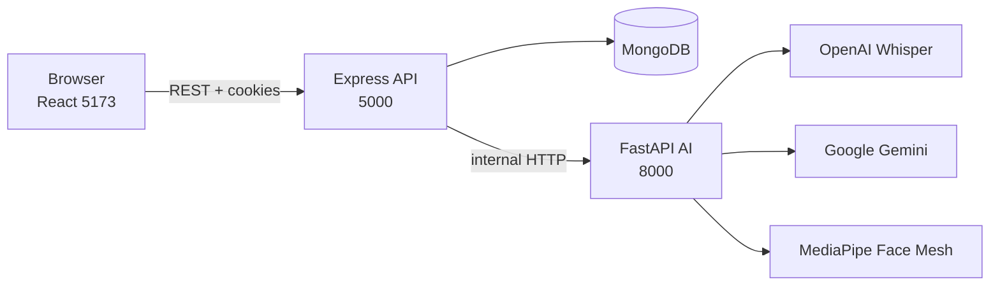

# SmartAssess-AI

Automated AI mock interviews: React + Vite client, Node/Express API, MongoDB, and a Python FastAPI service for Whisper transcription, Gemini grading, and MediaPipe gaze scoring.



## Ports

| Service | Port |
| --- | --- |
| Client | 5173 |
| Node API | 5000 |
| AI service | 8000 |

Camera/mic only work on **localhost** or **HTTPS**.

## One-command setup

1. Install [Node 20+](https://nodejs.org), [Python 3.11](https://www.python.org/), and [MongoDB](https://www.mongodb.com/try/download/community) (local `mongodb://127.0.0.1:27017` by default).
2. Start MongoDB (Windows): `net start MongoDB` or open MongoDB Compass and confirm it is running.
3. From the repo root `F:\SmartAssess AI`:

```bash
npm run setup
npm run seed
npm run dev
```

The API now also loads demo accounts and job roles automatically on startup if they are missing, so empty logins should not happen after `npm run dev`.

`setup` installs JS deps, creates `ai-service/.venv`, installs Python packages, and copies `.env.example` → `.env` if missing.

Open http://localhost:5173

### Demo accounts (after seed)

| Role | Email | Password |
| --- | --- | --- |
| Admin / HR | `admin@smartassess.ai` | `Admin@123` |
| Candidate | `jordan@demo.ai` | `Candidate@123` |

The seed also creates 3 open roles (10 questions each) and one completed sample interview so the HR dashboard is never empty.

## Environment

Copy and edit:

- `server/.env` — `MONGO_URI`, `JWT_SECRET`, `CLIENT_ORIGIN`, `AI_SERVICE_URL`
- `ai-service/.env` — `GEMINI_API_KEY`, `OPENAI_API_KEY` (optional)
- `client/.env` — `VITE_API_URL=/api/v1` (Vite proxies to the API)

If Gemini or Whisper keys are missing, the AI service runs in **Demo mode** (deterministic mock scores). The UI shows a Demo mode badge. Set `MOCK_MODE=always` or `never` to force behavior.

Scoring (server): `overall = 0.6 * technical + 0.4 * confidence` (weights in env). Verdicts: Strong Hire ≥ 8.5, Hire ≥ 7, Borderline ≥ 5.5, else Reject.

## API (`/api/v1`)

Consistent envelope: `{ success, message, data }`. Auth: `Bearer` token or httpOnly `token` cookie.

| Method | Path | Who | Purpose |
| --- | --- | --- | --- |
| POST | `/auth/register` | public | Candidate signup |
| POST | `/auth/login` | public | Login |
| POST | `/auth/logout` | public | Clear cookie |
| GET | `/auth/me` | auth | Current user |
| GET/PUT | `/profile` | candidate | Resume profile |
| GET | `/roles` | public | Open roles (paginated, search/filter) |
| GET | `/roles/:id` | public | Role detail |
| CRUD | `/admin/roles` | admin | Roles + toggle |
| POST | `/admin/roles/generate-questions` | admin | Gemini (or mock) 10 questions |
| POST | `/applications/:roleId` | candidate | Apply (profile ≥ 70%) |
| GET | `/applications/me` | candidate | My applications |
| GET | `/admin/applications` | admin | All applications |
| POST | `/interviews/start/:applicationId` | auth | Start / resume |
| POST | `/interviews/:id/answers` | candidate | Multipart audio + frames |
| POST | `/interviews/:id/complete` | auth | Finalize scores |
| GET | `/interviews/:id` | auth | Full report |
| GET | `/admin/dashboard` | admin | KPIs + charts data |
| GET | `/admin/export.csv` | admin | CSV export |
| GET | `/ai/status` | auth | Mock / live flags |

Python service (called only by Node): `GET /health`, `POST /analyze-frames`, `POST /transcribe-grade`, `POST /generate-questions`.

## Product flows

- **Candidate:** register → profile wizard (autosave, 70% gate) → jobs → apply → 10-question recorded interview → result.
- **Admin:** login → dashboard charts → create/edit/delete roles (manual or AI questions) → candidates → report.

Interview: getUserMedia + MediaRecorder, JPEG frames every 500ms, tab-hide logged as distraction, refresh warning, resume from last saved answer.

## Design

Monochrome Luxe: white / gray / black tokens in `client/tailwind.config.js` and `client/src/styles/index.css`. Dark/light persisted. Motion via Framer Motion; Lenis smooth scroll on the landing page. Unsplash photography is grayscale-filtered with gradient fallbacks.

Animation patterns adapted from the broader shadcn / Magic UI / Aceternity / 21st.dev vocabulary (border beam, marquee, blur-in headlines, tilt cards) and restyled to this palette.

## Scripts

```bash
npm run dev      # client + server + AI together
npm run seed     # reset demo data
npm run build    # vite production build
npm run lint     # client eslint
```

## Decisions

- Browser talks only to Node; AI keys never leave the Python/Node hosts.
- Gaze uses MediaPipe Face Mesh `refine_landmarks` (iris 468 / 473). If OpenCV/MediaPipe is missing, gaze falls back to mock.
- Audio stored under `server/uploads/audio` with size cap (`MAX_AUDIO_MB`).
- Admin accounts cannot be self-registered (register always creates `candidate`).

## Tested (local)

- `npm run setup`, seed, `npm run dev`
- Auth: register, login, logout, protected routes, 404
- Profile autosave and apply gate
- Apply + interview upload path (demo AI)
- Admin role CRUD + Generate with AI
- Dashboard charts + candidate report
- `vite build`

Camera hardware cannot be fully exercised in headless automation; permission and no-device error paths are implemented in the Interview page.
